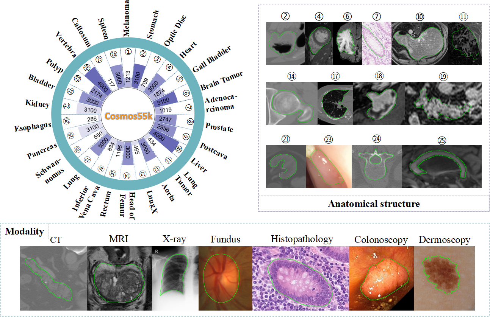
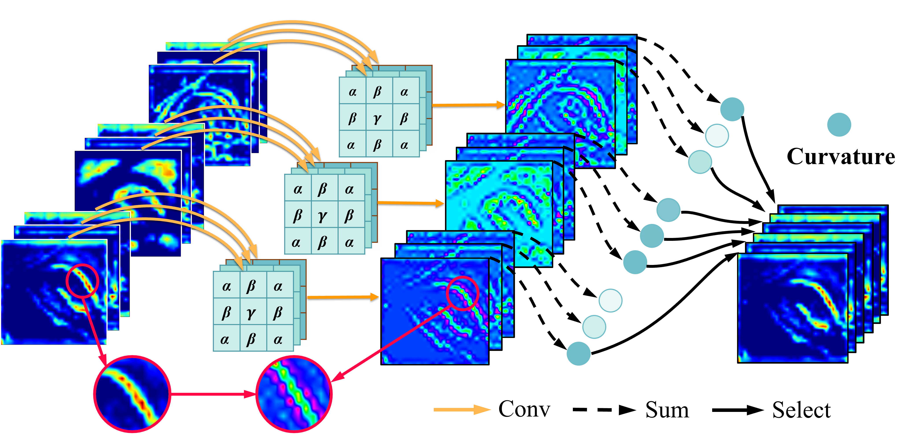
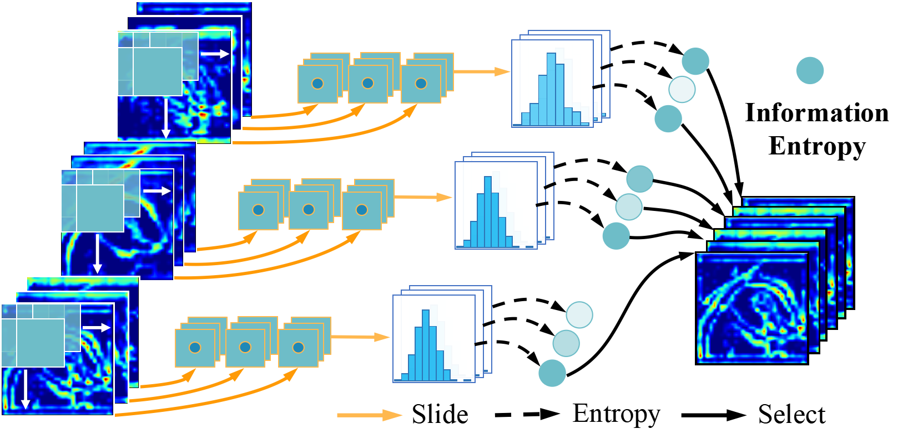

# Instructive Feature Enhancement for Dichotomous Medical Image Segmentation (MICCAI2023)

> **Authors:** 
> Lian Liu, 
> Han Zhou, 
> Jiongquan Chen,
> Sijing Liu, 
> Wenlong Shi,
> Dong Ni,
> [Deng-Ping Fan](https://dengpingfan.github.io/), and
> Xin Yang.

## Description
### 1.1. Overview

      
    <em> 
    Figure 1: Statistics, modalities, and examples of anatomical structures in Cosmos55k.
    </em>

      
    <em> 
    Figure 2: Example of feature selection using curvature.
    </em>

      
    <em> 
    Figure 3: Example of feature selection using 2D information entropy.
    </em>

### 1.2. Usage

We look forward to publishing the code as soon as possible and hope that it proves to be useful in your research or applications.
